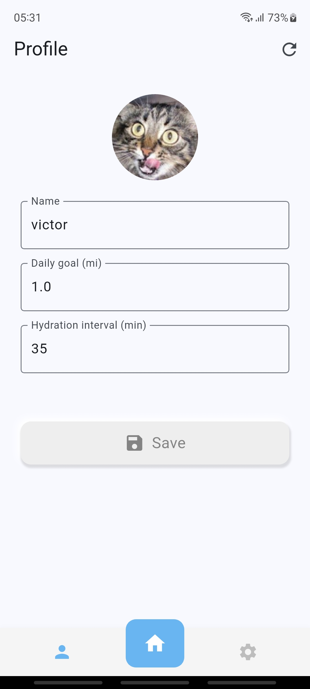

# HidraFit - Your Daily Health Companion

## Project Overview

HidraFit is an app designed to help users maintain healthy habits through:

- **Daily Walking Goal Tracking**
- **Smart Reminders for Hydration**

## Screenshots

  
  
  

## Main Features

### 🚶‍♂️ Step Monitoring

- Customizable daily goal setting
- Real-time progress tracking
- Visual graph of activity history
- Integration with device sensors

### 💧 Hydration Reminders

- Customizable interval settings
- Gentle notifications to remind you to drink water

## Technologies Used

- **Flutter** (Cross-platform framework)
- **Firebase** (Backend and authentication)

## License

This project is licensed under the MIT License - see the LICENSE file for details.

## Next Steps

- Weekly/monthly statistics
- Theme customization
